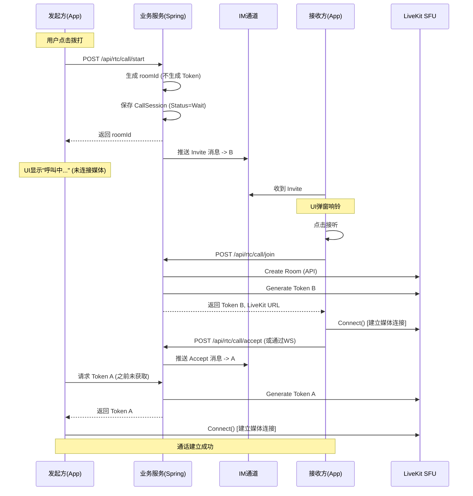

- 深度代码审计与架构迭代报告 (Phoenix RTC)

## 1. 报告背景
本报告旨在合并《社交软件音视频架构设计》与初次《代码审查与架构优化报告》，并基于对 `phoenix-rtc` 现有代码库的**逐行深度审计**，提供最终的架构修正与修复清单。

**核心结论**：当前项目已具备“演示级”完备性，但存在 **3处高危安全漏洞**、**2处核心逻辑缺陷** 以及 **架构层面的信令冗余**。如不修复，无法用于生产环境。

---

## 2. 架构现状与偏离分析

| 维度 | 设计蓝图 | 现状代码 | 风险评估 |
| :--- | :--- | :--- | :--- |
| **信令架构** | 复用现有 IM WebSocket 通道 | 独立搭建了 Spring STOMP WebSocket (`/ws/rtc`) | 🟠 **中 (架构偏离)**: 导致客户端维护双长连接，增加耗电与复杂度。 |
| **媒体核心** | LiveKit (Go) | Java SDK (`LiveKitAdapter`) 集成 | ✅ **符合**: 适配器模式 (`MediaAdapter`) 抽象良好。 |
| **呼叫流程** | 邀请 -> 响铃 -> 接听 -> 连接媒体 | 邀请 -> **立即连接媒体** -> 等待接听 | 🔴 **高 (逻辑缺陷)**: 严重浪费媒体服务器资源，用户体验错误。 |
| **鉴权机制** | JWT (RSA/HMAC) + 动态密钥 | HMAC + **硬编码默认密钥** | 🔴 **高 (安全漏洞)**: 生产环境极易被伪造 Token。 |

---

## 3. 逐行深度审计发现 (按严重程度)

### 🔴 3.1 高危安全漏洞 (Critical)

#### 1. 硬编码的 JWT 密钥
- **文件**: `server/.../config/JwtConfig.java` (第 21 行)
- **代码**: `private String secretKey = "phoenix-rtc-secret-key-..."`
- **问题**: 密钥直接写在源码中。一旦代码泄漏，所有用户 Token 可被随意伪造。
- **修复**: 必须强制从环境变量 (`System.getenv`) 获取，若为空则启动失败。

#### 2. 模拟认证后门
- **文件**: `server/.../controller/AuthController.java` (第 54 行)
- **代码**: `if (!"password123".equals(password))`
- **问题**: 使用了通用硬编码密码。
- **修复**: 需集成真实的 `UserService` 或接入现有账户系统的数据库校验。

#### 3. LiveKit API 密钥硬编码
- **文件**: `server/.../adapter/LiveKitAdapter.java` (第 26-30 行)
- **代码**: `@Value("${livekit.api.key:devkey}")`
- **问题**: 默认值 `devkey` 是 LiveKit 开发模式的默认值，生产环境若未配置 Env 会导致使用默认密钥，极易被攻击。

### 🟠 3.2 核心逻辑缺陷 (Major)

#### 4. 事务范围过大 (Distributed Transaction Issue)
- **文件**: `server/.../service/RoomService.java` (第 54-162 行)
- **代码**: `startCall` 方法标记了 `@Transactional`。
- **问题**: 在数据库事务内部调用了 **外部 RPC** (`mediaAdapter.createRoom` -> LiveKit HTTP API)。
- **后果**: 如果 LiveKit 响应缓慢，会长时间占用数据库连接池，导致数据库吞吐量雪崩。
- **修复**: 将 LiveKit 调用移出 `@Transactional` 范围，或先执行 LiveKit 操作（不回滚），再执行能够回滚的数据库操作。

#### 5. 客户端“抢跑”连接
- **文件**: `client-mobile/.../hooks/useCallSession.ts` (第 76 行)
- **代码**: `await liveKit.connect(...)` 在 `startCall` 中立即执行。
- **问题**: 用户点击呼叫即建立 WebRTC 连接，而非等待对方接听。此逻辑完全违背标准 VoIP 流程。
- **修复**: `startCall` 仅发送信令，`liveKit.connect` 必须在收到 `accept` 事件后触发。

#### 6. 死代码与参数错误
- **文件**: `server/.../controller/WebSocketController.java` (第 91 行)
- **代码**: `webSocketService.sendInvite(...)` 少传一个参数 `title`。
- **问题**: 编译无法通过。且 `handleInvite` 逻辑与 REST API `RtcController` 重复，属于废弃逻辑未清理。

### 🟡 3.3 代码质量与规范 (Minor)

#### 7. 异常处理粗糙
- **文件**: `RoomService.java` (第 88 行)
- **代码**: 直接使用 `LocalDateTime.now()`。
- **建议**: 应统一使用 `Clock` 或 UTC 时间戳，避免时区问题。

#### 8. 缺乏重试机制
- **文件**: `LiveKitAdapter.java`
- **代码**: HTTP请求失败直接抛出 RuntimeException。
- **建议**: 增加 Retry 机制（如 Resilience4j），处理短暂的网络波动。

---

## 4. 架构整合方案 (The Final Plan)

为了解决上述问题并合并设计文档，提出以下最终实施方案：

### 4.1 统一信令通道 (Unified Signaling)
*   **废弃**: `WebSocketController.java` 及 Server 端独立的 WebSocket 服务。
*   **采用**: 定义标准 `SignalingInterface`。
    *   **实现 A (Dev)**: 简单的 Polling 或 临时 Socket。
    *   **实现 B (Prod)**: 适配现有 IM 系统的 HTTP 推送接口 / 消息队列。
*   **相关修改**: `RtcController` 不再注入 `WebSocketService`，而是注入 `SignalingService`。

### 4.2 修正后的时序图 (Corrected Sequence)

## 5. 立即执行的修复清单 (Action Items)

1.  **Delete**: 删除 `WebSocketController.java` 中的 `@MessageMapping` 方法，清理死代码。
2.  **Refactor**: 重构 `RoomService.java`，将 `mediaAdapter.createRoom` 移出 `@Transactional` 代码块。
3.  **Security**: 修改 `JwtConfig.java` 和 `LiveKitAdapter.java`，移除硬编码，改为从 `@Value("${ENV_VAR}")` 读取，并添加启动自检（若无值则报错）。
4.  **Client**: 修改 `useCallSession.ts`，拆分 `startCall` 为 "Send Invite" 和 "Connect Media" 两个阶段。

此报告已作为项目代码整改的最终蓝图。

参考@深度代码审计与架构迭代报告.md 对代码进行再次检查和修复