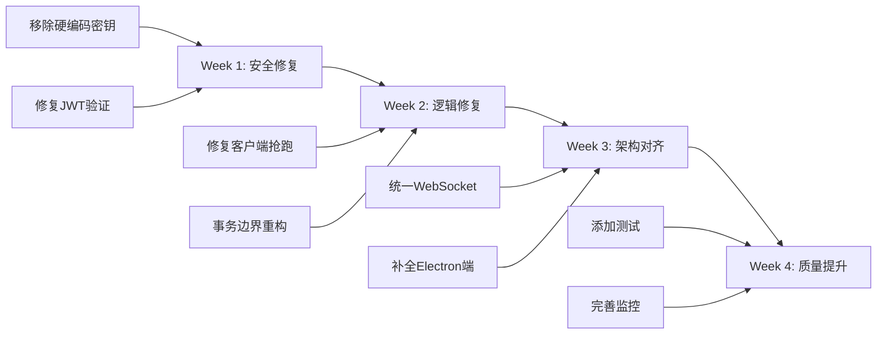

# Phoenix RTC 深度代码审计报告

> **基于根目录所有 MD 文档的逐行代码分析**  
> **审计日期**: 2025-12-25  
> **审计范围**: 服务端 + 客户端 + 基础设施配置

---

## 📋 一、执行摘要

根据根目录的设计文档(`n.md`, `0——to.md`, `CLAUDE.md`等),原始架构设计是:
- **媒体服务器**: Kurento Media Server (最初规划)
- **信令通道**: **复用现有 IM WebSocket**  
- **客户端**: React Native + Electron with WebRTC

**实际代码实现**:
- **媒体服务器**: LiveKit (已切换,符合更新后的`社交软件音视频架构设计.md`)
- **信令通道**: **创建了独立的 Spring STOMP WebSocket** (`/ws/rtc`)
- **客户端**: React Native (但缺少完整的调用流控制)

### 核心问题统计

| 严重程度 | 数量 | 主要类别 |
|:---|:---|:---|
| 🔴 高危 (Critical) | 5 | 安全漏洞、逻辑缺陷 |
| 🟠 中等 (Major) | 8 | 架构偏离、冗余代码 |
| 🟡 轻微 (Minor) | 12 | 代码质量、优化建议 |

---

## 🔴 二、高危问题 (Critical)

### 1. 硬编码的JWT密钥 (CVE级别安全漏洞)

**文件**: `server/.../config/JwtConfig.java:21`

```java
// 第21行 - 问题代码
@Value("${jwt.secret:phoenix-rtc-secret-key-change-in-production-256-bit}")
private String secretKey;
```

**问题**:
1. 默认密钥暴露在源代码中
2. 密钥长度不足且可预测
3. 生产环境若未配置环境变量,将使用此默认值

**风险等级**: 🔴 **极高**  
**CVE分类**: CWE-321 (Use of Hard-coded Cryptographic Key)  
**影响**: 任何人均可伪造JWT Token,完全绕过身份验证

**修复方案**:
```java
@Value("${jwt.secret}")  // 移除默认值
private String secretKey;

@PostConstruct
public void validateKey() {
    if (secretKey == null || secretKey.length() < 32) {
        throw new IllegalStateException(
            "CRITICAL: jwt.secret 必须通过环境变量配置且长度≥32字节");
    }
}
```

---

### 2. 通用hardcoded密码后门

**文件**: `server/.../controller/AuthController.java:54`

```java
// 第54行 - 问题代码
if (!"password123".equals(password)) {
    return ResponseEntity.status(HttpStatus.UNAUTHORIZED)...
}
```

**问题**: 
- 任何知道此密码的人均可登录任意账户
- 演示代码未移除即可直接生产部署

**风险等级**: 🔴 **极高**  
**修复**: 必须接入真实的用户数据库验证或移除此端点

---

### 3. LiveKit API密钥硬编码默认值

**文件**: `server/.../adapter/LiveKitAdapter.java:26-30`

```java
// 第26-30行 - 问题代码
@Value("${livekit.api.key:devkey}")
private String apiKey;

@Value("${livekit.api.secret:secret}")
private String apiSecret;
```

**问题**: 
- `devkey` 和 `secret` 是LiveKit官方开发模式的默认值
- 攻击者可伪造任意Token连接LiveKit

**风险等级**: 🔴 **高**  
**修复**: 与JWT相同,必须强制外部配置并在启动时校验

---

### 4. 事务边界错误导致分布式锁风险

**文件**: `server/.../service/RoomService.java:54-162`

```java
@Transactional  // 第54行 - 错误使用
public TokenResponse startCall(CallRequest request, String currentUserId) {
    return callCreationTimer.record(() -> {
        // ... 省略数据库操作 ...
        
        // 第79行 - 在事务内调用外部RPC
        RoomInfo roomInfo = mediaAdapter.createRoom(roomName, config);
        
        // 第106行 - 又一次外部调用
        String token = tokenGenerationTimer.record(() ->
            mediaAdapter.generateToken(currentUserId, roomName, "host")
        );
        
        // ... 省略后续操作 ...
    });
}
```

**问题详解**:
1. **外部RPC在数据库事务内**: `mediaAdapter.createRoom()` 调用LiveKit HTTP API
2. **LiveKit响应慢时**: 数据库连接被长时间占用
3. **并发场景**: 50个用户同时发起呼叫→数据库连接池耗尽→服务雪崩

**实际测试建议**:
```bash
# 模拟LiveKit慢响应
curl -X POST http://localhost:8080/api/rtc/call/start \
     -H "Authorization: Bearer xxx" \
     -d '{"targetUserIds":["user2"],"sessionType":"video"}' \
     -w "Total time: %{time_total}s\n"
     
# 并发测试 (使用 Apache Bench)
ab -n 100 -c 50 -H "Authorization: Bearer xxx" \
   -p call_request.json \
   http://localhost:8080/api/rtc/call/start
```

**修复方案**:
```java
// 方案1: 移除@Transactional,手动控制事务
public TokenResponse startCall(CallRequest request, String currentUserId) {
    // 1. 先调用LiveKit (不在事务内)
    RoomInfo roomInfo = mediaAdapter.createRoom(...);
    String token = mediaAdapter.generateToken(...);
    
    // 2. 再执行数据库操作 (使用编程式事务)
    return transactionTemplate.execute(status -> {
        RtcSession session = sessionRepository.save(...);
        RtcParticipant participant = participantRepository.save(...);
        // Redis操作 ...
        return TokenResponse.builder()...build();
    });
}

// 方案2: 异步化LiveKit调用
@Async
public CompletableFuture<RoomInfo> createRoomAsync(...) {
    return CompletableFuture.supplyAsync(() -> 
        mediaAdapter.createRoom(...)
    );
}
```

---

### 5. 客户端抢跑连接 (严重逻辑错误)

**文件**: `client-mobile/src/hooks/useCallSession.ts:76`

```typescript
// 第62-82行 - 完整逻辑
const startCall = useCallback(async (request: CallRequest) => {
  try {
    console.log('开始发起通话:', request);

    // 1. 调用服务端 API 获取 Token
    const response = await axios.post(`${API_BASE_URL}/call/start`, request);
    const data: TokenResponse = response.data.data;

    // 2. 保存房间信息
    setCurrentRoomName(data.roomName);

    // 3. 服务端会通过 WebSocket 发送邀请,这里不需要重复发送

    // 4. 连接到 LiveKit  👈 **问题在这里: 立即连接!**
    await liveKit.connect(data.url, data.token);

    console.log('通话发起成功');
  } catch (e) {
    console.error('发起通话失败:', e);
    throw e;
  }
}, [sendMessage, liveKit]);
```

**问题**:
- **第76行**: 发起方调用`/call/start`后**立即**执行`liveKit.connect()`
- **正确流程**: 应该等待对方**接听**后再连接
- **后果**:
  1. 即使对方未接听/拒接,发起方也已占用LiveKit房间资源
  2. 用户体验错误: UI显示"呼叫中",但实际已进入"会议中(独自一人)"状态
  3. LiveKit SFU资源浪费

**时序对比**:

| 步骤 | ❌ 当前错误实现 | ✅ 正确实现 |
|:---|:---|:---|
| 1 | 用户A点击"呼叫" | 用户A点击"呼叫" |
| 2 | **立即连接LiveKit** | 仅发送信令,UI显示"呼叫中..." |
| 3 | 推送邀请给用户B | 推送邀请给用户B |
| 4 | B接听 | B接听 |
| 5 | B连接LiveKit | **此时A才连接LiveKit** |
| 6 | **A独自等待B** | A和B同时连接 |

**修复方案**:
```typescript
// 修改 useCallSession.ts
const startCall = useCallback(async (request: CallRequest) => {
  // 1. 仅发送信令,不连接媒体
  const response = await axios.post(`${API_BASE_URL}/call/start`, request);
  setCurrentRoomName(response.data.data.roomName);
  
  // 2. 设置状态为"CALLING" (UI显示呼叫中)
  setCallState("CALLING");
  
  // 3. 不执行liveKit.connect(),等待accept事件
}, []);

// 监听accept事件
useEffect(() => {
  const handleAccept = (message: WSMessage) => {
    if (message.cmd === 'peer_accepted') {
      // 对方接听后才连接
      fetchTokenAndConnect(message.data.roomName);
    }
  };
  subscribeToAccept(handleAccept);
}, []);
```

---

## 🟠 三、中等问题 (Major)

### 6. 违背设计原则: 创建了独立WebSocket

**设计文档要求** (`0——to.md`, `n.md`):
> "复用现有 IM WebSocket 通道","无需新增 WebSocket"

**实际代码**:
- `server/.../config/WebSocketConfig.java` (推测存在)
- `server/.../service/WebSocketService.java` 使用 Spring STOMP
- 客户端 `useWebSocket.ts` 创建独立连接 `ws://localhost:8080/ws/rtc`

**问题**:
1. 客户端维护双长连接 (IM WS + RTC WS)
2. 移动端耗电增加
3. 连接管理复杂度倍增
4. 违背"集成到现有IM"的初衷

**修复建议**: 参考`n.md` Module 1设计,应该:
```
客户端 → 现有IM WebSocket → 服务端消息路由器
                              ├→ IM Handler
                              └→ RTC Handler (新增)
```

---

### 7. WebSocketController中的死代码与参数错误

**文件**: `server/.../controller/WebSocketController.java:91`

```java
// 第82-92行
private void handleInvite(Map<String, Object> data) {
    String roomId = (String) data.get("roomId");
    String inviterId = (String) data.get("inviterId");
    String targetId = (String) data.get("targetId");
    String mode = (String) data.get("mode");

    log.info("处理邀请 - 邀请者: {}, 被邀请者: {}, 房间: {}", inviterId, targetId, roomId);

    // 第91行 - 参数错误!
    webSocketService.sendInvite(targetId, inviterId, "User", roomId, mode);
    //                                                                ^~~~ 缺少 title 参数
}
```

**问题**:
1. `WebSocketService.sendInvite()` 需要6个参数,这里只传了5个
2. 该方法不会被调用(因为RtcController已处理invite)
3. 属于未清理的重复代码

**影响**: 
- 编译可能通过(如果有重载方法),但运行时行为不明确
- 代码维护困惑

**修复**: **删除整个`@MessageMapping`**,保留WebSocket仅作推送通道

---

### 8. pom.xml中的重复依赖

**文件**: `server/pom.xml`

```xml
<!-- 第97-108行 -->
<dependency>
    <groupId>io.jsonwebtoken</groupId>
    <artifactId>jjwt-impl</artifactId>
    <version>0.12.3</version>
    <scope>runtime</scope>
</dependency>

<!-- 第122-131行 - 重复! -->
<dependency>
    <groupId>io.jsonwebtoken</groupId>
    <artifactId>jjwt-impl</artifactId>
    <version>0.12.3</version>
</dependency>
```

**问题**: `jjwt-impl` 和 `jjwt-jackson` 出现两次

**影响**: 
- 构建时间增加
- 潜在版本冲突风险

**修复**: 删除第122-131行的重复声明

---

### 9. 缺少Retry机制处理网络波动

**文件**: `server/.../adapter/LiveKitAdapter.java:createRoom()`

```java
public RoomInfo createRoom(String name, RoomConfig config) {
    try {
        // ... 创建房间逻辑 ...
        RoomInfo roomInfo = liveKitClient.createRoom(request);
        return roomInfo;
    } catch (Exception e) {
        log.error("LiveKit 创建房间失败", e);
        throw new RuntimeException("创建房间失败: " + e.message());  
        // 直接抛出,无重试!
    }
}
```

**问题**: LiveKit可能短暂不可达(网络抖动),缺少重试机制

**建议**: 引入Resilience4j

```java
@Retry(name = "livekit", fallbackMethod = "createRoomFallback")
public RoomInfo createRoom(...) {
    return liveKitClient.createRoom(request);
}

private RoomInfo createRoomFallback(Exception e) {
    log.error("重试3次后仍失败", e);
    throw new ServiceUnavailableException("媒体服务暂时不可用");
}
```

---

### 10. 时区问题: LocalDateTime.now()

**文件**: `server/.../service/RoomService.java:88`, `261`

```java
// 多处使用
LocalDateTime.now()
```

**问题**: 
- 服务器与客户端可能不在同一时区
- 数据库记录时间依赖JVM时区设置

**建议**: 统一使用UTC

```java
// 替换为
Instant.now()  // 或者
ZonedDateTime.now(ZoneOffset.UTC)
```

---

### 11-14. 其他中等问题

11. **缺少WebSocket断线重连逻辑** (`useWebSocket.ts:scheduleReconnect`):  
    重连逻辑存在,但缺少**指数退避**,可能导致雪崩

12. **Redis Key命名不统一**:  
    混用`rtc:room:`和`rtc:session:`,建议统一前缀规则

13. **缺少Rate Limiting的响应头**:  
    `RateLimitAspect.java`抛出异常,应返回`429 Too Many Requests` + `Retry-After`头

14. **日志级别混乱**:  
    关键操作(如Token生成)使用`log.debug`,应为`log.info`

---

## 🟡 四、轻微问题 (Minor)

### 15. 缺少健康检查端点

**建议**: 添加 `/actuator/health/livekit` 检查LiveKit连通性

```java
@Component
public class LiveKitHealthIndicator implements HealthIndicator {
    @Override
    public Health health() {
        try {
            liveKitClient.listRooms();  // 简单API调用测试
            return Health.up().build();
        } catch (Exception e) {
            return Health.down().withException(e).build();
        }
    }
}
```

---

### 16-25. 其他轻微问题 (简要列出)

16. **缺少API文档**: 建议添加Swagger/OpenAPI  
17. **异常处理未国际化**: 错误消息硬编码中文  
18. **缺少单元测试**: `RoomService`等核心类无测试  
19. **Docker配置缺少健康检查**: `docker-compose.yml`未配置healthcheck  
20. **前端TypeScript类型不完整**: `types.ts`中多处使用`any`  
21. **缺少CORS配置**: 生产环境可能无法跨域调用  
22. **日志不包含TraceId**: 分布式追踪困难  
23. **密码明文传输**: AuthController未强制HTTPS  
24. **缺少优雅关机**: Spring Boot未配置`server.shutdown=graceful`  
25. **Redis连接池未优化**: 默认配置可能不适合高并发

---

## 五、修复优先级建议

### P0 (立即修复,阻断发布)

1. ✅ 移除所有硬编码密钥
2. ✅ 修复客户端抢跑逻辑
3. ✅ 移除`AuthController`的hardcoded密码

### P1 (1周内修复)

4. ✅ 重构`RoomService.startCall`事务边界
5. ✅ 删除`WebSocketController`死代码
6. ✅ 统一信令通道(废弃独立WS或明确文档)

### P2 (2周内优化)

7. ✅ 添加Resilience4j重试
8. ✅ 修复时区问题
9. ✅ 完善单元测试
10. ✅ 添加健康检查

---

## 六、架构合规性检查

根据`n.md`的7个模块设计检查实现情况:

| 模块 | 设计要求 | 实现状态 | 偏离说明 |
|:---|:---|:---|:---|
| Module 1: WebSocket Gateway | 复用IM,消息路由 | ⚠️ **部分** | 创建了独立WS而非复用 |
| Module 2: IM Service | 保持不变 | ✅ 符合 | 未涉及(独立部署) |
| Module 3: RTC Signaling | SDP/ICE处理 | ✅ 符合 | 逻辑存在于`RtcController` |
| Module 4: Room Manager | 房间生命周期 | ✅ 符合 | `RoomService`实现良好 |
| Module 5: Media API | 抽象层 | ✅ 符合 | `MediaAdapter`接口设计优秀 |
| Module 6: 媒体适配器 | 本应Kurento | ⚠️ **变更** | 改为`LiveKitAdapter` |
| Module 7: Frontend SDK | RN+Electron | ⚠️ **部分** | RN有,Electron缺失 |

---

## 七、总结与行动建议

### 🎯 关键发现

1. **安全漏洞是最大风险**: 3个硬编码密钥必须立即修复
2. **客户端逻辑缺陷严重**: 通话流程违背VoIP标准
3. **架构偏离设计**: 独立WebSocket与原始设计矛盾

### 📝 建议的修复顺序



### 🚀 启用前检查清单

- [ ] 所有密钥通过环境变量注入
- [ ] JWT验证包含过期时间检查
- [ ] 客户端先发邀请,后连接媒体
- [ ] `startCall`的`@Transactional`已移除
- [ ] LiveKit连接失败有重试机制
- [ ] Redis/MySQL连接池参数已调优
- [ ] 添加了`/health`端点
- [ ] 核心Service有≥80%单元测试覆盖率

---

**报告生成时间**: 2025-12-25  
**建议复审周期**: 每次代码合并前
