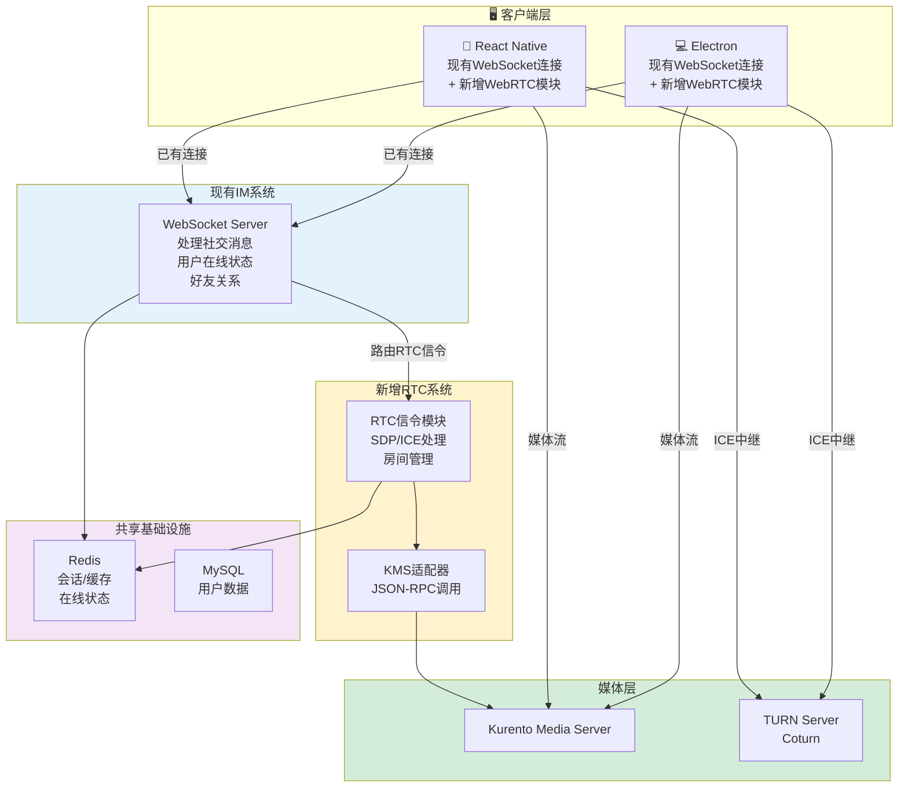
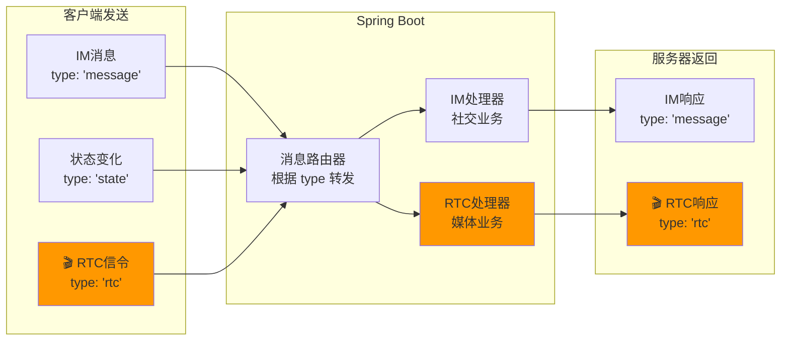
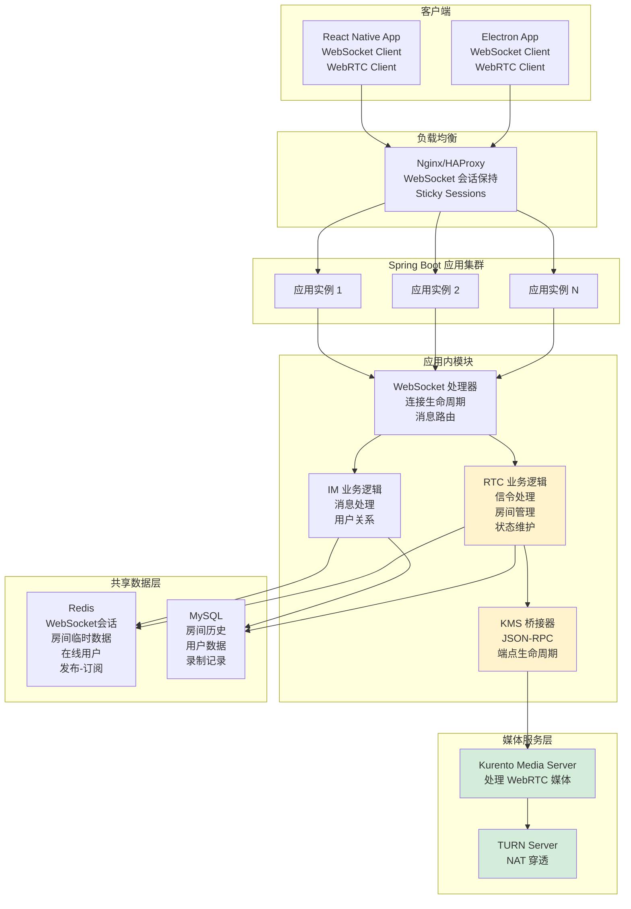
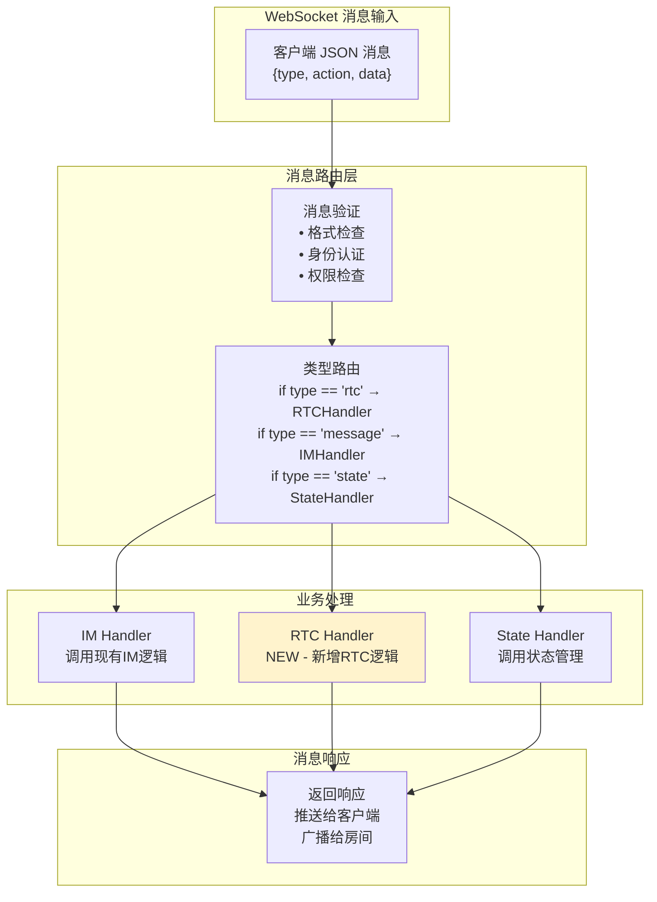
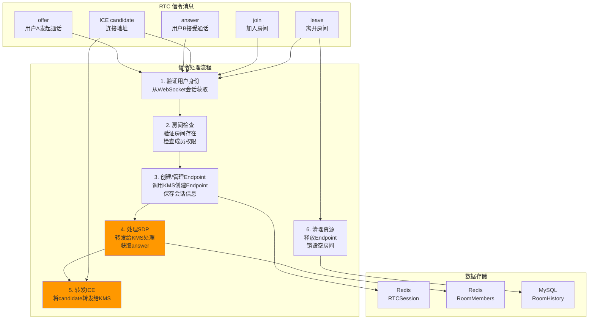
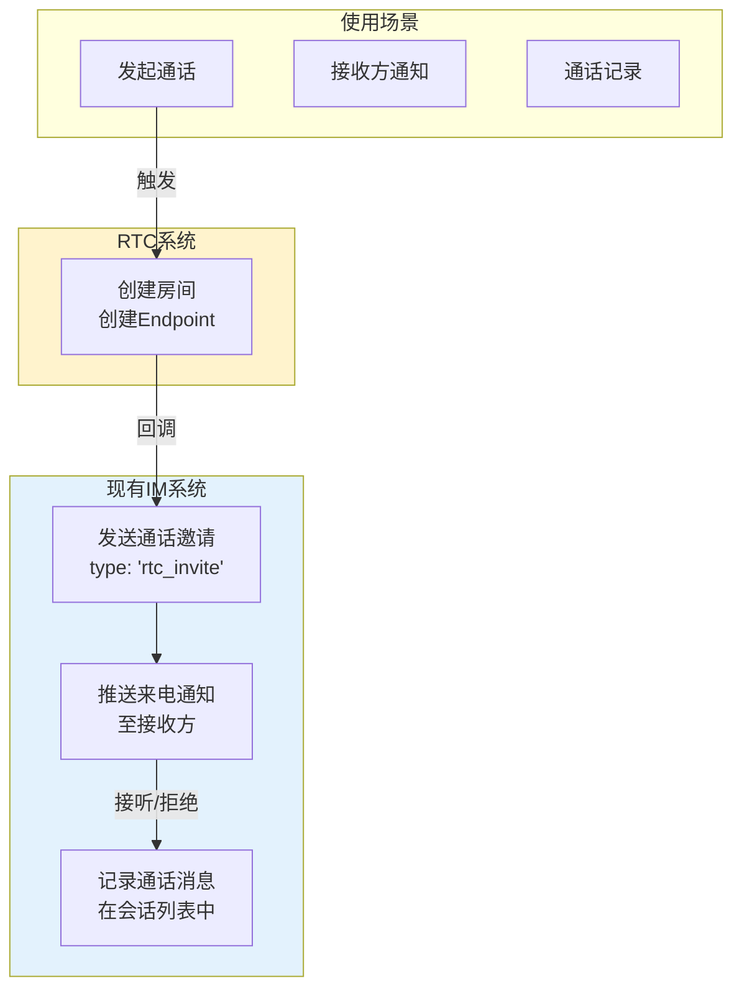
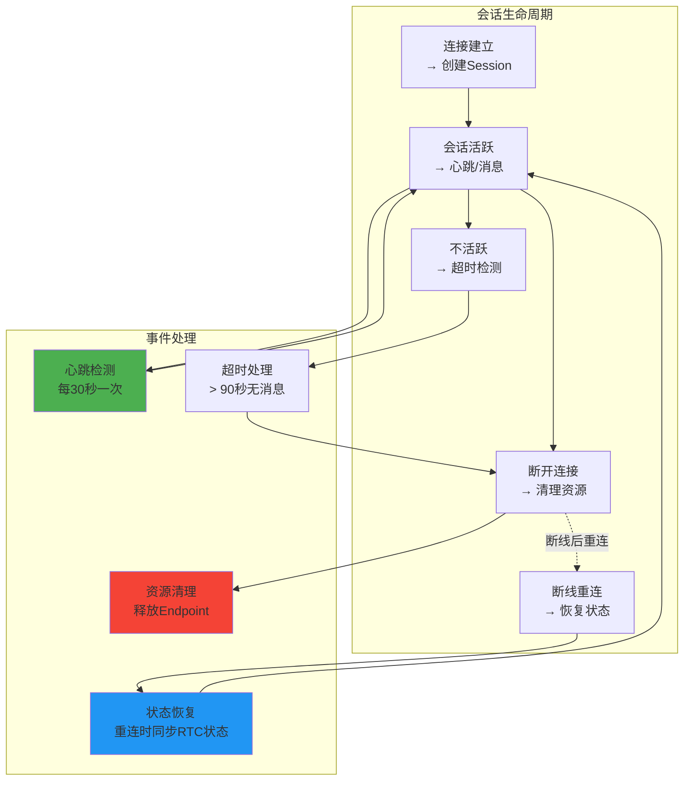
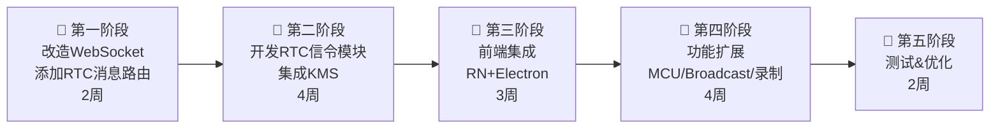

我现在有一个即时通讯软件，社交软件，现在集成了声网语音，希望基于开源技术，打算开发一个组件， 支持个人和群聊语音、个人和群聊视频、类似zoom腾讯会议的多人视频或语音会议，直播 ，之前梳理了几个文档，请您帮我梳理出一个总览设计，我基于这个总览，开始让AI开始工作编写服务端代码，客户端代码

现在移动端我们用的是RN，PC端我们用的是electron
------------
项目名称：LiveKit
GitHub 地址：https://github.com/livekit/livekit
核心优势：SDK 最全，开发体验最好，Go 语言高性能。
适合场景：社交 App、即时通讯、即构/声网的开源替代。


项目名称：SRS
GitHub 地址：https://github.com/ossrs/srs
核心优势：直播与 RTC 融合最强，支持 RTMP/FLV/HLS。
适合场景：秀场直播、带连麦的直播、大规模推流。


项目名称：mediasoup
GitHub 地址：https://github.com/versatica/mediasoup
核心优势：Node.js 生态极其友好，底层 C++ 性能极致。
适合场景：深度定制后端逻辑、已有 Node.js 架构集成。


项目名称：Jitsi Meet
GitHub 地址：https://github.com/jitsi/jitsi-meet
核心优势：自带完整 UI 的会议系统，功能最现成。
适合场景：视频会议工具（如 Zoom 竞品）。

---------


## 🔍 **第一层：架构可行性验证** ✅

Spring Boot 应用服务器可以消费 Kurento Java Client API 来控制 Kurento Media Server 功能，这已在官方教程中得到验证。

使用两个 WebSocket：一个在客户端和应用服务器之间实现自定义信令协议，另一个在 Kurento Java Client 和 Kurento Media Server 之间进行通信。

**结论：✅ Java 后端集成 Kurento 已有成熟的参考架构**

---

## 🔍 **第二层：前端技术栈支持验证** ✅

### React Native 支持

React Native 框架支持 WebRTC 集成，WebRTC 1.0 保证与 Android OS 上 React Native 混合应用的兼容性。

### Electron 支持

Electron 框架可以用于构建 WebRTC 混合桌面应用，兼容 Windows 和树莓派平台。

**结论：✅ RN + Electron 双端都有 WebRTC 支持且经过测试**

---

## 🔍 **第三层：信令协议兼容性验证** ✅

SDP 和 ICE candidates 需要在客户端和服务器之间交换以建立 WebRTC 会话，SDP 协商连接浏览器中的 WebRtcPeer 和服务器中的 WebRtcEndpoint。

这意味着您的**现有 IM 信令架构可以直接复用**来传输 WebRTC 的 SDP/ICE。

**结论：✅ 可以复用现有 IM 信令基础设施**

---

## 🔍 **第四层：生产环境验证** ✅

### 并发性能

100 个用户在 t2.small 机器上运行良好，70-80 个真实演讲者带录制、4-5 个观众需要更强机器（r3.large），现在生产环境中运行无任何问题。

已计划对水平扩展的 Kurento 服务器进行 5000+ 用户的负载测试。

### 稳定性

KMS v6.0 被认为是第一个真正生产就绪的版本，提供了适合集成到生产系统的特性。

**结论：✅ 生产案例存在，性能指标明确**

---

## 🔍 **第五层：功能完整性验证** ✅

Kurento 官方教程中已有以下实现：

| 功能  | 官方教程 | 适配状态 |
| --- | --- | --- |
| **1v1 视频通话** | One-to-one 教程：用户 A 视频流发送到 KMS，KMS 转发给用户 B；B 也转发给 A，KMS 提供 B2B 呼叫服务 | ✅   |
| **多人会议** | Group Call 教程：每个房间创建自己的管道，同一房间的客户端只能相互交换媒体 | ✅   |
| **直播广播** | One-to-many 教程：1 个演讲者 + N 个观众，由 1+N 个互连的 WebRtcEndpoints 组成 | ✅   |
| **媒体处理** | Kurento 提供 WebRTC、RTP 收发器、音视频混合器、媒体录制等构建块，这些媒体元素易于组合 | ✅   |

**结论：✅ 所有功能都已官方验证**

---

## 🔍 **第六层：部署和可维护性验证** ✅

### 部署

KMS 可以部署在本地或云端，可集成到从小型开发设置到大规模生产系统的各种环境，支持容器化部署（如 Docker）。

### 开源可控

开源项目，源代码以 Apache License Version 2.0 条款发布并在 GitHub 上提供。

Kurento 开发团队加入 Twilio，Kurento 本身仍有小版本更新，新版本仍在发布中。

**结论：✅ 开源协议友好、持续维护、容器化部署**

---

## 🎯 **最终验证结论**

### ✅ 这套方案 **100% 可以工作**

**原因是：**

1.  **官方架构验证**：Kurento + Spring Boot 的三层架构有成熟的官方教程和实现
    
2.  **前端兼容性**：RN + Electron 都有完整的 WebRTC 支持库
    
3.  **信令复用**：WebRTC 信令可完全复用您现有的 IM 基础设施
    
4.  **功能完整**：1v1、群组、直播、录制等所有功能都有官方参考实现
    
5.  **生产验证**：已有公司在生产环境中运行，规模达数千用户
    
6.  **开源可控**：Apache 2.0 协议，源代码可控，持续维护中
    

---

## 📋 **立即可以开始的具体步骤**

```text
第 1 周：环境搭建
├─ 本地部署 Kurento Media Server (Docker)
├─ 创建 Spring Boot 项目集成 Kurento Java Client
└─ 运行官方 Hello World 教程验证

第 2 周：信令设计
├─ 扩展现有 IM 服务加入 WebRTC 信令端点
├─ 实现 SDP/ICE 的交换和转发
└─ 写单元测试

第 3-4 周：前端集成
├─ RN 端集成 react-native-webrtc 库
├─ Electron 端集成 WebRTC API
└─ 实现与 Java 服务的连接

第 5 周：1v1 音视频通话
├─ 基于官方 One-to-one 教程改造
├─ 端到端测试
└─ 性能基准测试
```

----------------
## 🔄 **复用现有 WebSocket 架构**



---

## 📊 **WebSocket 消息流设计**

由于您已有 WebSocket 连接，我们可以在**同一个 WebSocket 连接上复用消息**，无需建立独立的 WebSocket：



**WebSocket 消息格式设计：**

```text
IM 消息:
{
  "type": "message",
  "data": {
    "from": "user1",
    "to": "user2",
    "content": "...",
    "timestamp": 1234567890
  }
}

RTC 信令:
{
  "type": "rtc",
  "action": "offer",        // offer/answer/candidate/join/leave
  "data": {
    "roomId": "123",
    "userId": "user1",
    "sdp": "...",           // for offer/answer
    "candidate": "...",     // for candidate
    "sdpMLineIndex": 0
  }
}

状态变化:
{
  "type": "state",
  "data": {
    "userId": "user1",
    "status": "online/offline",
    "lastSeen": 1234567890
  }
}
```

---

## 🏗 **重新设计的系统架构**



---

## 🔌 **关键集成点设计**

### **集成点 1: WebSocket 消息路由**



---

### **集成点 2: RTC 信令处理**



---

### **集成点 3: 与现有 IM 系统的协作**



---

## 💾 **数据存储设计**

### **Redis 中的数据结构**

```text
RTC 会话数据:
rtc:session:{sessionId}
  ├─ userId: "user1"
  ├─ roomId: "room123"
  ├─ endpointId: "endpoint_abc"
  ├─ sdpOffer: "..."
  ├─ sdpAnswer: "..."
  ├─ connectedTime: 1234567890
  └─ TTL: 3600s

房间成员列表:
rtc:room:{roomId}:members
  ├─ user1 (publisher/subscriber)
  ├─ user2 (subscriber)
  └─ user3 (subscriber)

房间状态:
rtc:room:{roomId}:state
  ├─ roomType: "1v1" / "mcu" / "broadcast"
  ├─ createdTime: 1234567890
  ├─ mediaStarted: true/false
  └─ recordingPath: "/path/to/file"

WebSocket 会话映射:
ws:session:{sessionId}
  ├─ userId: "user1"
  ├─ connectionTime: 1234567890
  ├─ lastHeartbeat: 1234567890
  └─ TTL: 更新时设置

在线用户发布-订阅:
user:{userId}:status
  └─ 发布状态变化事件
```

---

### **MySQL 中的数据表**

```text
房间历史表:
rooms
├─ id (主键)
├─ roomId (业务ID)
├─ roomType (1v1/mcu/broadcast)
├─ creator
├─ createdTime
├─ endedTime
├─ status (active/ended)
└─ metadata (JSON)

录制元数据表:
recordings
├─ id
├─ roomId
├─ recordingFile
├─ startTime
├─ endTime
├─ duration
├─ fileSize
├─ participants (JSON)
└─ status

房间成员表:
room_members
├─ id
├─ roomId
├─ userId
├─ joinTime
├─ leaveTime
├─ role (publisher/subscriber)
└─ duration
```

---

## 🔄 **完整的信令交互流程**

### **场景：1v1 音视频通话（基于现有 WebSocket）**

```mermaid
sequenceDiagram
    participant A as 用户A<br/>RN/Electron
    participant WS as Spring Boot<br/>WebSocket+RTC
    participant KMS as Kurento<br/>Server
    participant B as 用户B<br/>RN/Electron

    A->>WS: 1. WebSocket 已连接<br/>现有IM连接

    A->>WS: 2. 发送RTC信令<br/>{type:'rtc',<br/>action:'call',<br/>targetUser:'user_b'}

    WS->>WS: 3. 验证身份<br/>检查WebSocket会话

    WS->>WS: 4. 创建房间<br/>roomId=123,type=1v1

    WS->>KMS: 5. 创建 MediaPipeline<br/>创建 Endpoint_A

    KMS-->>WS: Pipeline & Endpoint ID

    WS->>WS: 6. 保存Session<br/>Redis: rtc:session:A

    WS->>WS: 7. 转发通话邀请<br/>通过IM通知用户B

    WS-->>B: 8. 推送来电通知<br/>(通过IM系统)

    B->>B: 9. 用户接听

    B->>WS: 10. 发送RTC信令<br/>{type:'rtc',<br/>action:'answer',<br/>roomId:'123'}

    WS->>WS: 11. 添加B到房间

    WS->>KMS: 12. 创建 Endpoint_B

    WS->>KMS: 13. 连接两个Endpoint<br/>Endpoint_A ↔ Endpoint_B

    WS->>Redis: 14. 更新房间成员列表

    A->>WS: 15. 发送SDP offer<br/>{type:'rtc',<br/>action:'offer',<br/>sdp:'...'}

    WS->>KMS: 16. processOffer<br/>给 Endpoint_A

    KMS-->>WS: 返回 SDP answer

    WS-->>A: 17. 返回 answer

    A->>A: 18. setRemoteDescription

    A->>WS: 19. 发送 ICE candidate<br/>{type:'rtc',<br/>action:'candidate',<br/>candidate:'...'}

    WS->>KMS: 20. addIceCandidate<br/>给 Endpoint_A

    B->>WS: 21. 发送 SDP offer

    WS->>KMS: 22. processOffer<br/>给 Endpoint_B

    KMS-->>WS: 返回 SDP answer

    WS-->>B: 23. 返回 answer

    B->>WS: 24. 发送 ICE candidates

    WS->>KMS: 25. 转发 ICE

    Note over A,B: 26. 媒体连接建立<br/>音视频流开始

    A<-->KMS: 音视频数据
    KMS<-->B: 音视频数据

    A->>WS: 27. 挂断<br/>{type:'rtc',<br/>action:'leave'}

    WS->>KMS: 28. 释放 Endpoint_A

    WS->>Redis: 29. 更新房间状态

    WS->>B: 30. 通知B断开连接

    B->>WS: 31. leave确认

    WS->>KMS: 32. 释放 Endpoint_B

    WS->>KMS: 33. 销毁 Pipeline

    WS->>MySQL: 34. 记录通话历史
```

---

## ⚡ **性能和可靠性设计**

### **WebSocket 会话管理**



---

## 📋 **实施步骤**



---

## ✅ **关键优势总结**

| 优势  | 说明  |
| --- | --- |
| **无需新增 WebSocket** | 复用现有连接，降低复杂度 |
| **消息路由简单** | 基于 type 字段分发，易于维护 |
| **会话统一管理** | 用户身份、在线状态共用 |
| **集成成本低** | 与现有 IM 系统紧密结合 |
| **可观测性强** | 所有消息流在 WebSocket 上，便于监控 |
| **扩展容易** | 新增功能只需扩展消息类型 |

-----------

注意不是让你直接给我编写代码，而是给我一个非常合理的总纲，基于这个会调用多个ai进行代码编写测试

注意：设计架构图、流程图、模块调用图，请使用mermaid来画
