## 一、系统全景架构

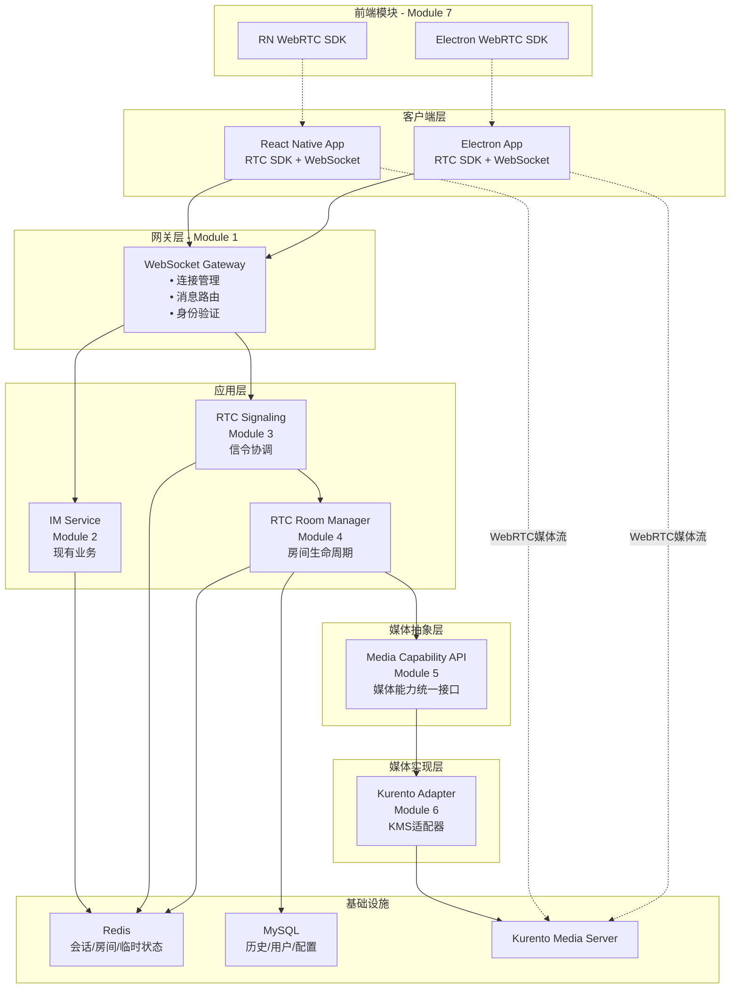

---

## 二、模块分解与 AI 任务编排

### **Module 1: WebSocket Gateway（网关层）**

**职责边界**：
- 管理 WebSocket 连接生命周期
- 按消息类型路由到对应服务
- 统一的异常处理和限流

**数据结构设计**：

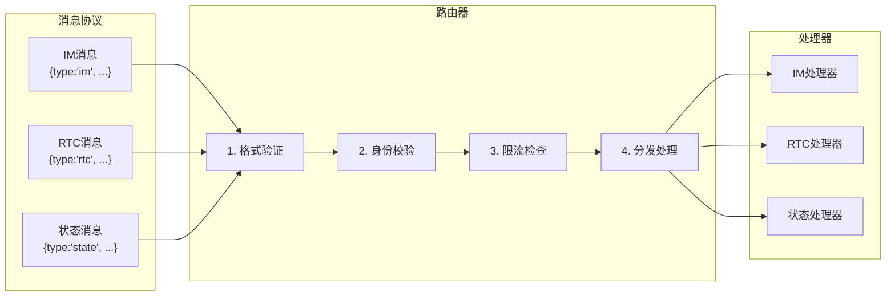

**AI 任务清单**：
```yaml
Task 1.1: 实现 WebSocket 连接管理器
  - 输入: Spring Boot WebSocket 配置
  - 输出: WebSocketHandler.java（连接/断开/心跳）
  - 验证: 1000 并发连接压测

Task 1.2: 实现消息路由器
  - 输入: 消息协议 JSON Schema
  - 输出: MessageRouter.java（路由逻辑 + 限流）
  - 验证: 单元测试覆盖率 > 90%

Task 1.3: 实现会话管理器
  - 输入: Redis 会话结构设计
  - 输出: SessionManager.java（创建/恢复/清理）
  - 验证: 断线重连测试用例
```

---

### **Module 2: IM Service（现有服务保持不变）**

**设计原则**：
- 只需要增加一个 **RTC 通话邀请消息类型**
- 不改动现有消息处理逻辑

**集成点设计**：

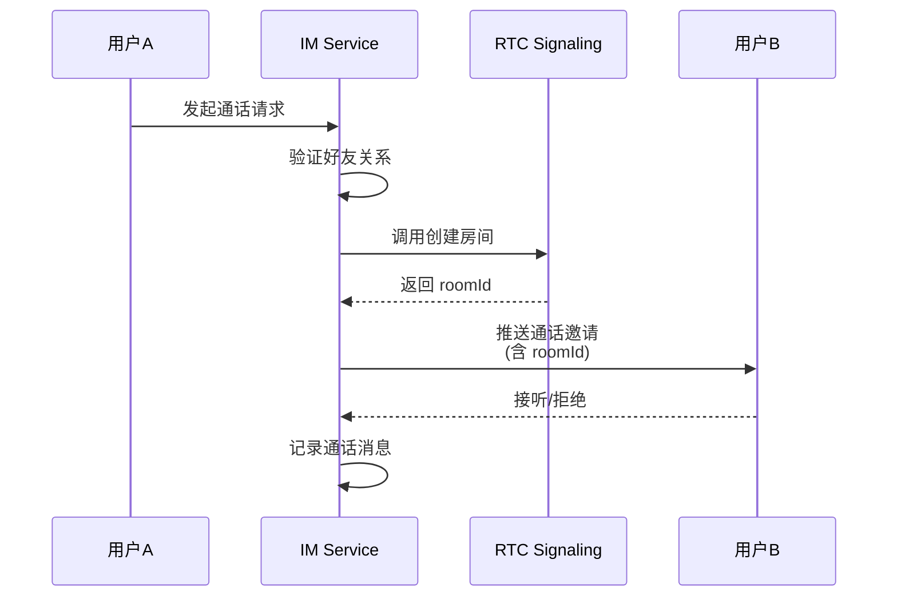

**AI 任务清单**：
```yaml
Task 2.1: 扩展 IM 消息类型
  - 输入: 现有消息类型枚举
  - 输出: 新增 RTC_CALL_INVITE / RTC_CALL_ANSWER
  - 验证: 消息能正常发送和接收

Task 2.2: 实现 RTC 服务调用接口
  - 输入: RTC Service API 定义
  - 输出: RTCServiceClient.java
  - 验证: Mock 测试
```

---

### **Module 3: RTC Signaling（信令协调器）**

**核心职责**：
- 处理 SDP Offer/Answer
- 转发 ICE Candidate
- 协调房间成员加入/离开

**状态机设计**：

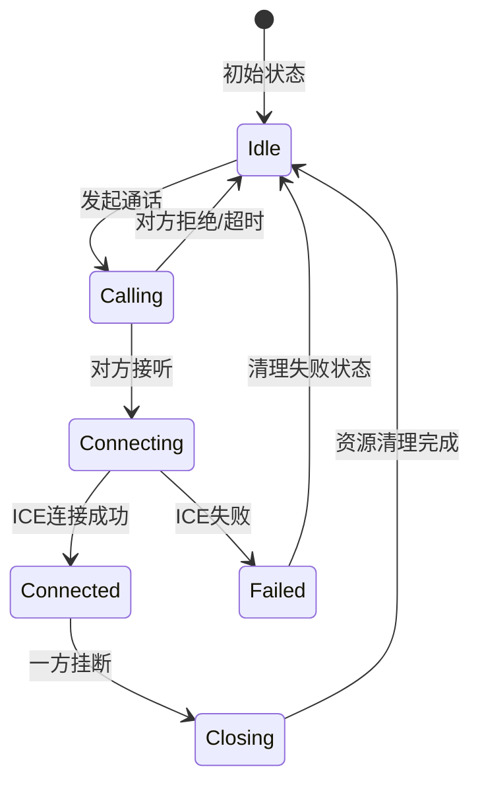

**数据流设计**：

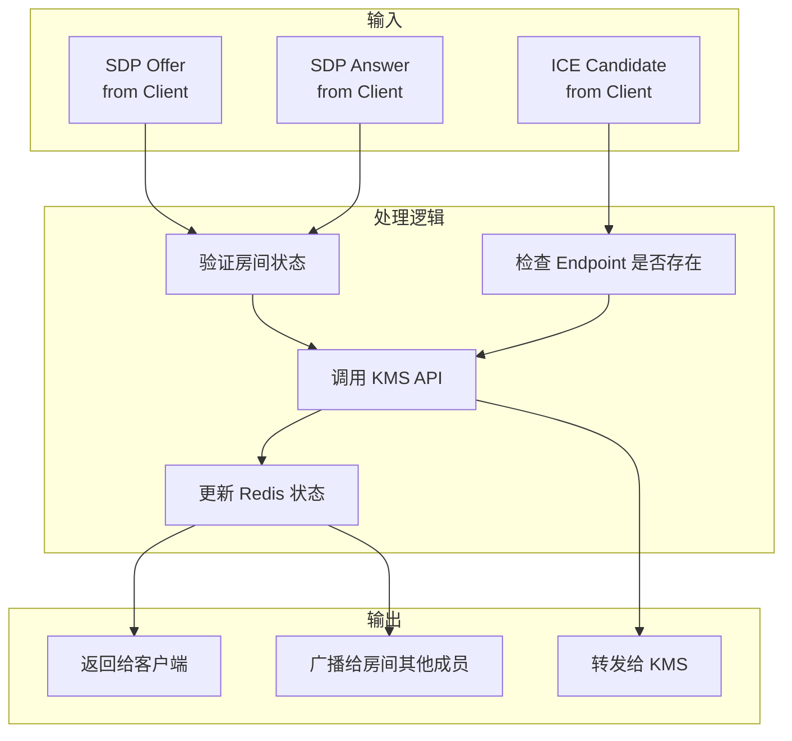

**AI 任务清单**：
```yaml
Task 3.1: 实现 SDP 协商处理器
  - 输入: WebRTC SDP 格式规范
  - 输出: SDPNegotiator.java（offer/answer 处理）
  - 验证: 单元测试 + Postman 模拟客户端

Task 3.2: 实现 ICE Candidate 转发器
  - 输入: ICE 协议文档
  - 输出: IceCandidateHandler.java
  - 验证: 测试 P2P 和 TURN 场景

Task 3.3: 实现状态机管理器
  - 输入: 上述状态图
  - 输出: CallStateMachine.java
  - 验证: 状态转换测试用例
```

---

### **Module 4: RTC Room Manager（房间生命周期）**

**职责边界**：
- 创建/销毁房间
- 管理房间成员列表
- 处理房间类型切换（1v1 → 多人）

**房间类型设计**：

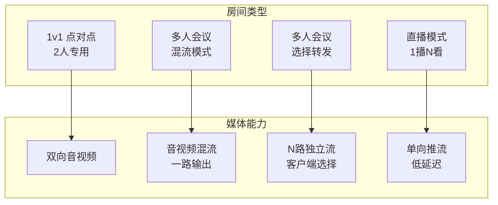

**Redis 数据结构**：

```yaml
# 房间元数据
rtc:room:{roomId}:meta
  roomType: "p2p" | "mcu" | "sfu" | "broadcast"
  creatorId: "user123"
  maxMembers: 50
  createdAt: timestamp
  status: "active" | "ended"
  pipelineId: "kms_pipeline_id"

# 房间成员（使用 Redis Set）
rtc:room:{roomId}:members
  → Set { "user1", "user2", "user3" }

# 成员详细信息（使用 Redis Hash）
rtc:room:{roomId}:member:{userId}
  endpointId: "kms_endpoint_abc"
  role: "publisher" | "subscriber"
  joinedAt: timestamp
  audioEnabled: true
  videoEnabled: false

# 房间临时状态（TTL 1 hour）
rtc:room:{roomId}:temp
  lastActivity: timestamp
  recordingPath: "/recordings/room123.webm"
```

**AI 任务清单**：
```yaml
Task 4.1: 实现房间创建器
  - 输入: 房间类型枚举 + Redis 结构
  - 输出: RoomFactory.java
  - 验证: 创建各类型房间并检查 Redis

Task 4.2: 实现成员管理器
  - 输入: 成员加入/离开事件
  - 输出: MemberManager.java
  - 验证: 并发加入/离开测试

Task 4.3: 实现房间清理器
  - 输入: 房间空闲超时策略
  - 输出: RoomCleaner.java（定时任务）
  - 验证: 空房间自动销毁测试
```

---

### **Module 5: Media Capability API（媒体能力抽象层）**

**设计目标**：
- 屏蔽底层媒体服务器差异
- 未来可切换到 LiveKit/SRS

**接口设计**：

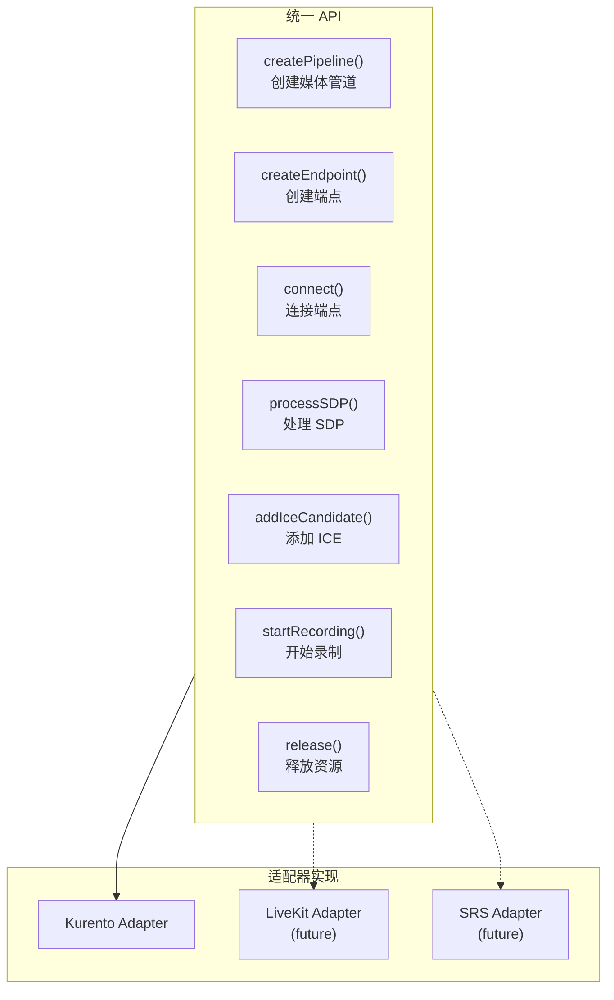

**接口定义示例**：

```java
public interface MediaService {
    
    // 创建媒体管道
    CompletableFuture<String> createPipeline(PipelineConfig config);
    
    // 创建端点
    CompletableFuture<Endpoint> createEndpoint(String pipelineId, EndpointType type);
    
    // 连接两个端点
    CompletableFuture<Void> connectEndpoints(String endpoint1, String endpoint2);
    
    // 处理 SDP
    CompletableFuture<String> processSdpOffer(String endpointId, String sdpOffer);
    
    // 添加 ICE Candidate
    CompletableFuture<Void> addIceCandidate(String endpointId, IceCandidate candidate);
    
    // 开始录制
    CompletableFuture<String> startRecording(String pipelineId, RecordingConfig config);
    
    // 释放资源
    CompletableFuture<Void> releaseEndpoint(String endpointId);
    CompletableFuture<Void> releasePipeline(String pipelineId);
}
```

**AI 任务清单**：
```yaml
Task 5.1: 定义 Media Service 接口
  - 输入: 上述 UML 图
  - 输出: MediaService.java 接口定义
  - 验证: 接口方法签名评审

Task 5.2: 定义数据传输对象
  - 输入: Kurento API 文档
  - 输出: DTO 类（PipelineConfig, Endpoint, IceCandidate 等）
  - 验证: JSON 序列化/反序列化测试
```

---

### **Module 6: Kurento Adapter（KMS 适配器）**

**职责边界**：
- 实现 Media Service 接口
- 管理与 KMS 的 WebSocket 连接
- 处理 KMS 事件回调

**连接管理设计**：

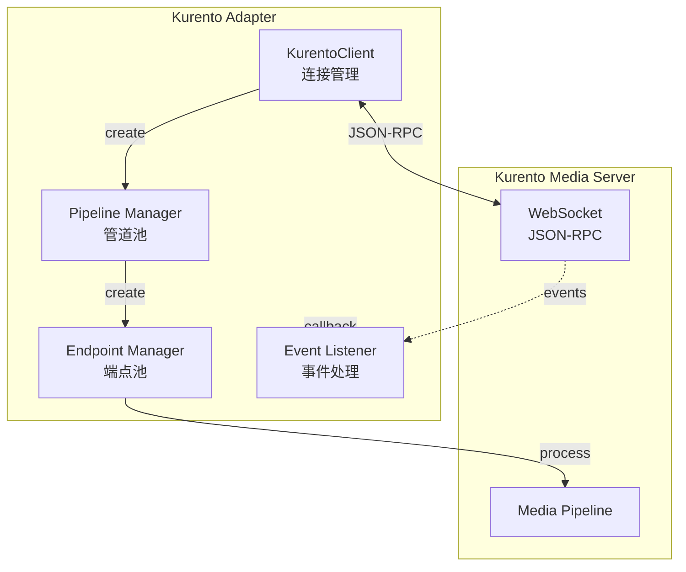

**错误处理策略**：

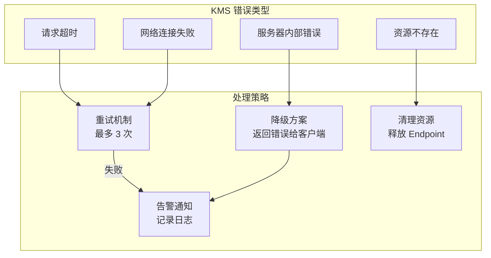

**AI 任务清单**：
```yaml
Task 6.1: 实现 Kurento Client 封装
  - 输入: KurentoClient Java SDK 文档
  - 输出: KurentoClientWrapper.java
  - 验证: 连接/断线/重连测试

Task 6.2: 实现 MediaService 接口
  - 输入: Module 5 的接口定义
  - 输出: KurentoMediaServiceImpl.java
  - 验证: 所有接口方法单元测试

Task 6.3: 实现事件监听器
  - 输入: KMS 事件文档（IceCandidateFound, MediaStateChanged）
  - 输出: KurentoEventHandler.java
  - 验证: Mock KMS 事件触发测试

Task 6.4: 实现资源池管理
  - 输入: 对象池设计模式
  - 输出: PipelinePool.java, EndpointPool.java
  - 验证: 并发创建/释放压测
```

---

### **Module 7: Frontend SDK（前端模块）**

**React Native SDK 设计**：

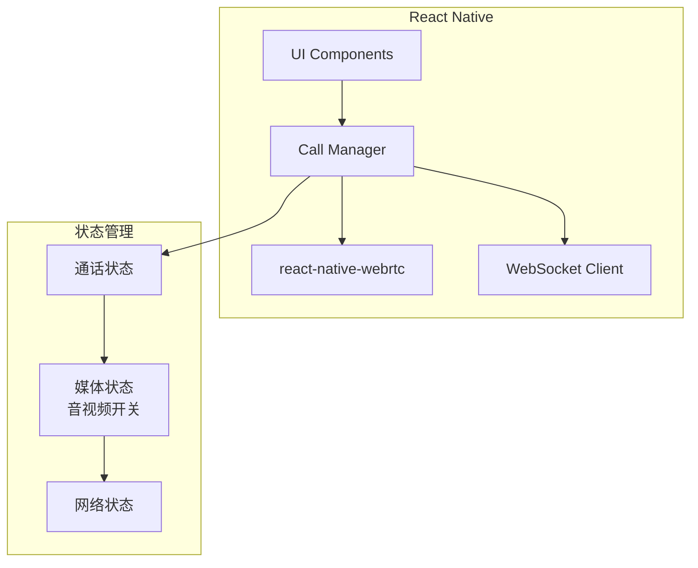

**前端状态机**：

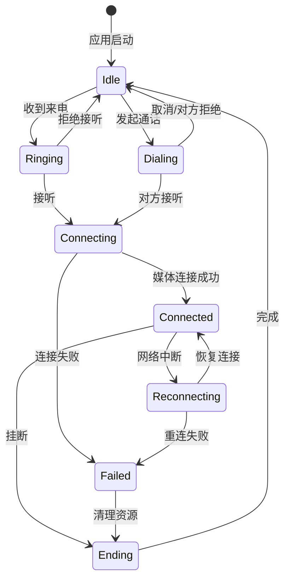

**AI 任务清单**：
```yaml
Task 7.1: 实现 RN WebRTC 封装
  - 输入: react-native-webrtc 文档
  - 输出: RTCManager.ts（createOffer/setRemoteDescription 等）
  - 验证: iOS/Android 真机测试

Task 7.2: 实现 Call Manager
  - 输入: 前端状态机图
  - 输出: CallManager.ts（状态转换逻辑）
  - 验证: 状态转换单元测试

Task 7.3: 实现信令客户端
  - 输入: WebSocket 消息协议
  - 输出: SignalingClient.ts
  - 验证: Mock 服务器测试

Task 7.4: 实现 UI 组件
  - 输入: 设计稿
  - 输出: CallScreen.tsx, VideoView.tsx
  - 验证: UI 截图对比测试

Task 7.5: Electron 适配
  - 输入: RN 实现代码
  - 输出: Electron 版本适配代码
  - 验证: Windows/macOS 测试
```

---

## 三、数据存储详细设计

### **Redis 数据结构完整定义**

```yaml
# WebSocket 会话（TTL: 90秒，心跳刷新）
ws:session:{sessionId}
  userId: "user123"
  connectedAt: timestamp
  lastHeartbeat: timestamp
  clientType: "rn" | "electron"
  clientVersion: "1.0.0"

# 用户在线状态（TTL: 动态更新）
user:{userId}:online
  sessionId: "session_abc"
  status: "online" | "busy" | "offline"
  lastSeen: timestamp

# RTC 房间元数据（TTL: 1小时）
rtc:room:{roomId}:meta
  roomType: "p2p" | "mcu" | "sfu" | "broadcast"
  creatorId: "user123"
  maxMembers: 50
  createdAt: timestamp
  status: "waiting" | "active" | "ended"
  pipelineId: "kms_pipeline_xyz"

# RTC 房间成员列表（Set）
rtc:room:{roomId}:members
  → Set { "user1", "user2", "user3" }

# 成员详细信息（Hash）
rtc:room:{roomId}:member:{userId}
  endpointId: "endpoint_abc"
  role: "publisher" | "subscriber"
  joinedAt: timestamp
  audioEnabled: true
  videoEnabled: true
  screenShareEnabled: false

# RTC 会话映射（双向索引）
rtc:session:{sessionId}
  userId: "user123"
  roomId: "room456"
  endpointId: "endpoint_abc"

rtc:user:{userId}:session
  → Set { "session1", "session2" }  # 支持多端同时在线

# 通话邀请缓存（TTL: 60秒）
rtc:invite:{inviteId}
  fromUserId: "user1"
  toUserId: "user2"
  roomId: "room123"
  createdAt: timestamp
  status: "pending" | "accepted" | "rejected" | "timeout"

# 限流计数器（TTL: 1分钟）
ratelimit:rtc:{userId}
  count: 10  # 1分钟内发起通话次数
```

### **MySQL 表结构设计**

```sql
-- 房间历史表
CREATE TABLE rtc_rooms (
    id BIGINT PRIMARY KEY AUTO_INCREMENT,
    room_id VARCHAR(64) UNIQUE NOT NULL,
    room_type ENUM('p2p', 'mcu', 'sfu', 'broadcast') NOT NULL,
    creator_id BIGINT NOT NULL,
    created_at DATETIME NOT NULL,
    ended_at DATETIME,
    duration_seconds INT,
    status ENUM('active', 'ended', 'error') NOT NULL,
    max_members INT DEFAULT 50,
    metadata JSON,
    INDEX idx_creator (creator_id),
    INDEX idx_created (created_at),
    INDEX idx_status (status)
) ENGINE=InnoDB DEFAULT CHARSET=utf8mb4;

-- 房间成员表
CREATE TABLE rtc_room_members (
    id BIGINT PRIMARY KEY AUTO_INCREMENT,
    room_id VARCHAR(64) NOT NULL,
    user_id BIGINT NOT NULL,
    role ENUM('publisher', 'subscriber') NOT NULL,
    joined_at DATETIME NOT NULL,
    left_at DATETIME,
    duration_seconds INT,
    audio_enabled BOOLEAN DEFAULT TRUE,
    video_enabled BOOLEAN DEFAULT TRUE,
    INDEX idx_room (room_id),
    INDEX idx_user (user_id),
    INDEX idx_joined (joined_at)
) ENGINE=InnoDB DEFAULT CHARSET=utf8mb4;

-- 录制文件表
CREATE TABLE rtc_recordings (
    id BIGINT PRIMARY KEY AUTO_INCREMENT,
    room_id VARCHAR(64) NOT NULL,
    file_path VARCHAR(512) NOT NULL,
    file_size_bytes BIGINT,
    duration_seconds INT,
    started_at DATETIME NOT NULL,
    ended_at DATETIME,
    status ENUM('recording', 'completed', 'failed') NOT NULL,
    codec VARCHAR(32),
    resolution VARCHAR(16),
    participants JSON,
    INDEX idx_room (room_id),
    INDEX idx_started (started_at)
) ENGINE=InnoDB DEFAULT CHARSET=utf8mb4;

-- 通话质量统计
CREATE TABLE rtc_quality_stats (
    id BIGINT PRIMARY KEY AUTO_INCREMENT,
    room_id VARCHAR(64) NOT NULL,
    user_id BIGINT NOT NULL,
    timestamp DATETIME NOT NULL,
    packet_loss_rate DECIMAL(5,2),
    jitter_ms INT,
    rtt_ms INT,
    bitrate_kbps INT,
    INDEX idx_room_time (room_id, timestamp),
    INDEX idx_user_time (user_id, timestamp)
) ENGINE=InnoDB DEFAULT CHARSET=utf8mb4;
```

---

## 四、关键流程设计

### **流程 1: 1v1 通话完整流程**

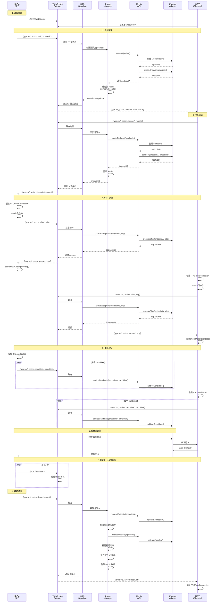

---

### **流程 2: 多人会议（MCU 模式）**

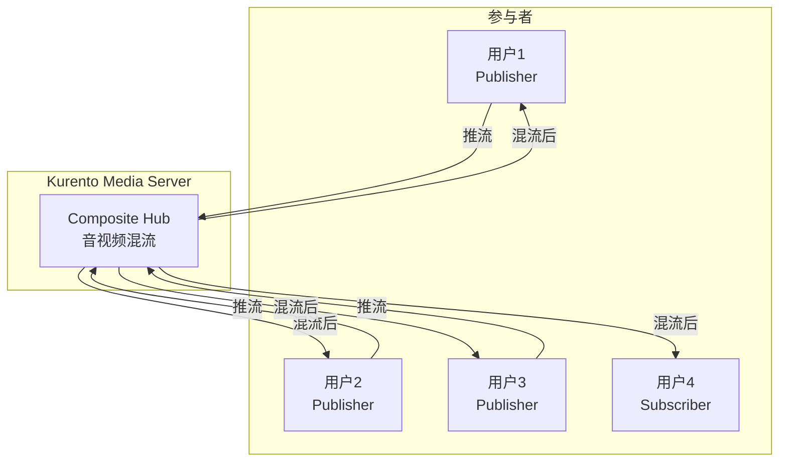

**关键差异点**：
- 所有成员连接到同一个 Composite Hub
- 服务器端混流，每个客户端只接收一路流
- 适合 5 人以上会议

---

### **流程 3: 直播模式**

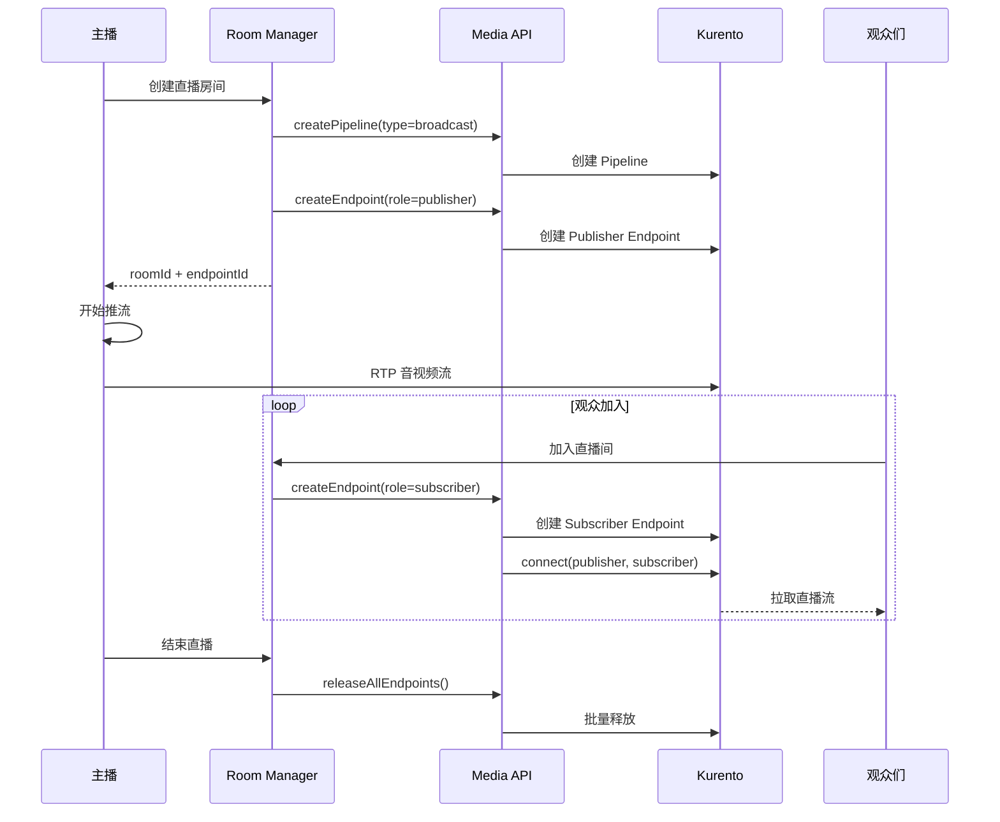

---

## 五、错误处理与容错设计

### **错误分类与处理策略**

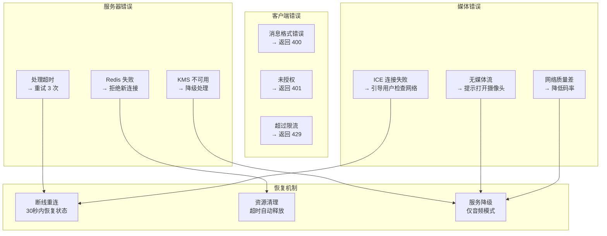

---

## 六、性能优化与监控

### **性能指标定义**

```yaml
WebSocket 层:
  - 并发连接数: 目标 10,000
  - 消息处理延迟: P99 < 50ms
  - 心跳超时检测: 90秒

RTC 信令层:
  - SDP 协商时间: P99 < 200ms
  - ICE 连接建立: P99 < 3s
  - 房间创建耗时: P99 < 500ms

媒体层:
  - Endpoint 创建: P99 < 300ms
  - 媒体首帧时间: P99 < 2s
  - Pipeline 复用率: > 80%

数据层:
  - Redis 操作: P99 < 10ms
  - MySQL 写入: P99 < 100ms
```

### **监控指标采集**

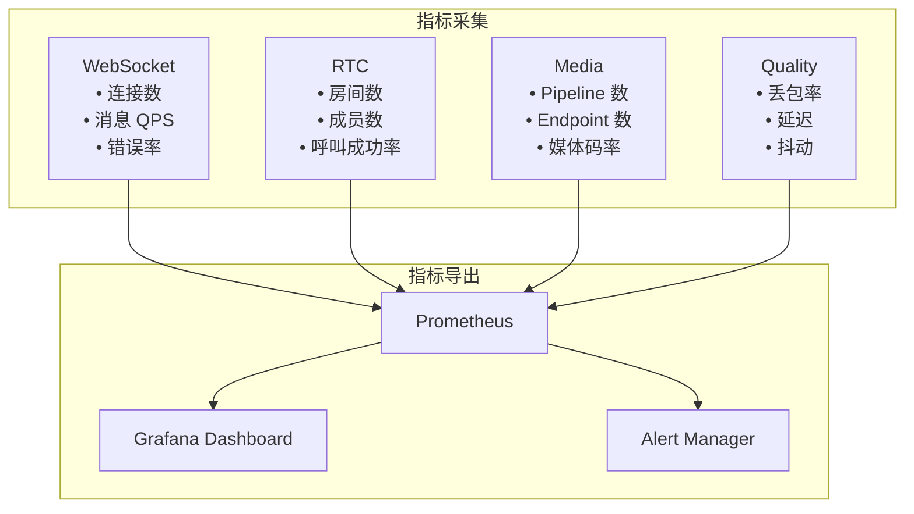

---

## 七、部署架构

### **生产环境拓扑**

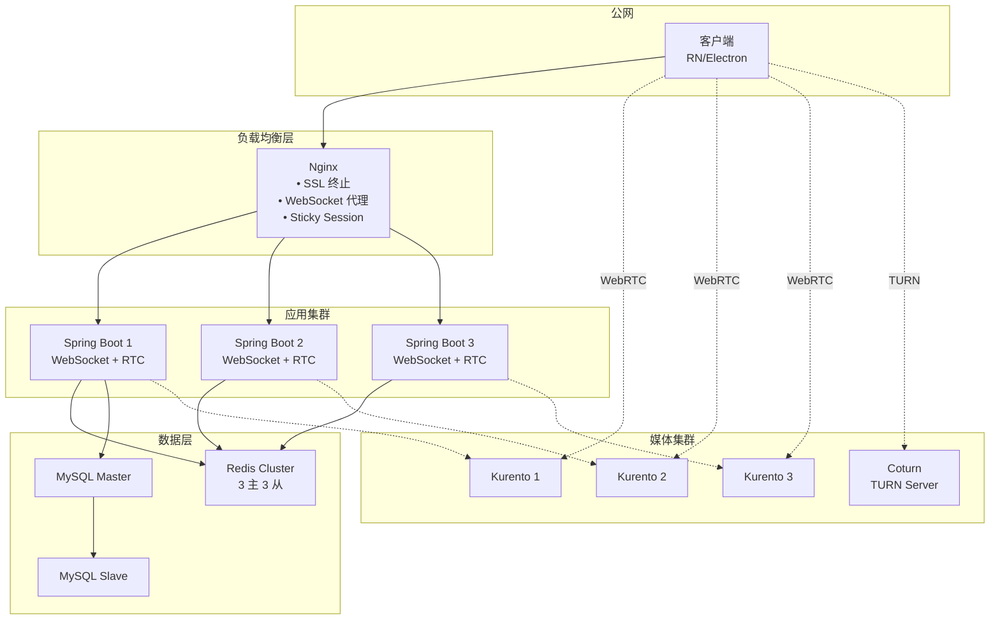

---

## 八、AI 执行任务总清单

### **Phase 1: 基础设施（2 周）**

```yaml
Week 1:
  - Task 1.1: WebSocket 连接管理器
  - Task 1.2: 消息路由器
  - Task 1.3: 会话管理器
  - Task 5.1: Media Service 接口定义
  - Task 5.2: DTO 定义

Week 2:
  - Task 6.1: Kurento Client 封装
  - Task 6.2: MediaService 实现
  - Task 6.3: 事件监听器
  - 集成测试: WebSocket + KMS 连通性
```

### **Phase 2: 核心功能（4 周）**

```yaml
Week 3:
  - Task 3.1: SDP 协商处理器
  - Task 3.2: ICE 转发器
  - Task 4.1: 房间创建器
  - Task 4.2: 成员管理器

Week 4:
  - Task 3.3: 状态机管理器
  - Task 4.3: 房间清理器
  - Task 2.1: IM 消息类型扩展
  - Task 2.2: RTC 服务调用接口

Week 5-6:
  - 完整 1v1 通话流程集成
  - 端到端测试（Mock 客户端）
  - 性能基准测试（100 并发通话）
```

### **Phase 3: 前端开发（3 周）**

```yaml
Week 7:
  - Task 7.1: RN WebRTC 封装
  - Task 7.2: Call Manager
  - Task 7.3: 信令客户端

Week 8:
  - Task 7.4: UI 组件
  - Task 7.5: Electron 适配

Week 9:
  - 前后端联调
  - 真机测试（iOS/Android/Windows/macOS）
```

### **Phase 4: 高级功能（4 周）**

```yaml
Week 10-11:
  - 多人会议（MCU 模式）
  - 直播模式
  - 屏幕共享

Week 12-13:
  - 录制功能
  - 媒体处理（美颜、水印）
  - 通话质量统计
```

### **Phase 5: 测试与优化（2 周）**

```yaml
Week 14:
  - 压力测试（1000+ 并发）
  - 稳定性测试（72 小时）
  - 安全测试

Week 15:
  - 性能优化
  - 监控告警配置
  - 文档编写
```

---

## 九、交付物清单

### **给 AI 的输入文件**

```yaml
/specs
  ├── api-definitions/
  │   ├── websocket-protocol.yaml      # WebSocket 消息协议
  │   ├── media-service-api.yaml       # Media Service 接口
  │   └── rest-api.yaml                # REST API 定义
  ├── data-models/
  │   ├── redis-structures.yaml        # Redis 数据结构
  │   ├── mysql-schema.sql             # MySQL 表结构
  │   └── dto-definitions.yaml         # 数据传输对象
  ├── state-machines/
  │   ├── call-state-machine.mmd       # 通话状态机
  │   ├── room-lifecycle.mmd           # 房间生命周期
  │   └── frontend-states.mmd          # 前端状态机
  └── flows/
      ├── 1v1-call-flow.mmd            # 1v1 通话流程
      ├── group-call-flow.mmd          # 群组通话流程
      └── broadcast-flow.mmd           # 直播流程
```

### **AI 输出的代码结构**

```yaml
/backend
  ├── gateway/                         # Module 1
  │   ├── WebSocketHandler.java
  │   ├── MessageRouter.java
  │   └── SessionManager.java
  ├── im/                              # Module 2
  │   ├── IMMessageHandler.java
  │   └── RTCServiceClient.java
  ├── rtc/                             # Module 3 + 4
  │   ├── signaling/
  │   │   ├── SDPNegotiator.java
  │   │   ├── IceCandidateHandler.java
  │   │   └── CallStateMachine.java
  │   └── room/
  │       ├── RoomFactory.java
  │       ├── MemberManager.java
  │       └── RoomCleaner.java
  ├── media/                           # Module 5 + 6
  │   ├── api/
  │   │   ├── MediaService.java
  │   │   └── dto/
  │   └── kurento/
  │       ├── KurentoClientWrapper.java
  │       ├── KurentoMediaServiceImpl.java
  │       ├── KurentoEventHandler.java
  │       ├── PipelinePool.java
  │       └── EndpointPool.java
  └── tests/
      ├── unit/
      ├── integration/
      └── e2e/

/frontend
  ├── rn/                              # Module 7
  │   ├── src/
  │   │   ├── managers/
  │   │   │   ├── RTCManager.ts
  │   │   │   ├── CallManager.ts
  │   │   │   └── SignalingClient.ts
  │   │   ├── screens/
  │   │   │   ├── CallScreen.tsx
  │   │   │   └── VideoView.tsx
  │   │   └── states/
  │   │       └── callState.ts
  │   └── __tests__/
  └── electron/
      └── src/
          ├── (同 RN 结构)
          └── adapters/
```

---

## 十、关键决策说明

### **为什么选择这个架构？**

1. **模块解耦**：每个模块职责单一，可以独立开发和测试
2. **抽象分层**：Media API 层让你未来可以替换 Kurento
3. **复用现有设施**：WebSocket、Redis、MySQL 都是现成的
4. **渐进式开发**：可以先做 1v1，再扩展到多人和直播
5. **可观测性**：所有消息经过统一网关，易于监控

### **关键技术选型理由**

| 组件  | 选型  | 理由  |
| --- | --- | --- |
| 媒体服务器 | Kurento | 官方 Java SDK 成熟，功能完整 |
| 信令传输 | 复用 WebSocket | 降低复杂度，统一连接管理 |
| 状态存储 | Redis | 高性能，支持 TTL 自动清理 |
| 历史记录 | MySQL | 持久化，支持复杂查询 |
| 前端框架 | RN + Electron | 你已有的技术栈 |

---

这份设计文档可以**直接交给 AI 执行**，每个 Task 都有明确的输入、输出和验证标准。你需要做的是：

1. **按 Phase 顺序执行**，不要跳跃
2. **每个 Task 完成后验证**，再进行下一个
3. **关键节点做集成测试**（如 Week 2、Week 6、Week 9）
4. **保持架构图与代码同步**，代码变更要更新文档